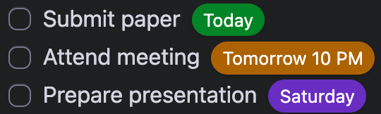

# Relative Dates

A simple plugin for Obsidian that transforms date references in your task lists into color-coded elements that show relative dates.

## Features

- Converts date references in the format `@ YYYY-MM-DD` (with optional time `HH:MM`) into relative dates
- Supports changing the default `@` prefix through the plugin settings
- Works in both Reading mode and Live Preview mode
- Color-coded elements based on date proximity (overdue, today, tomorrow, this week, future)
- Customizable colors through the plugin settings

## Usage

Add dates in your task lists using the format:

- `@ 2025-08-12` for dates
- `@ 2025-08-12 14:30` for dates with time

The plugin will automatically convert these into easy-to-read elements such as:



## Installation

After [#8099](https://github.com/obsidianmd/obsidian-releases/pull/8099) is merged and included in an Obsidian release, you can install this plugin directly from the Community plugins in Obsidian.

### Install from the latest release

1. Go to the [latest release](https://github.com/Munckenh/obsidian-relative-dates/releases/latest).
2. Download `main.js`, `manifest.json`, and `styles.css` from the release assets.
3. Create this folder in your vault: `.obsidian/plugins/obsidian-relative-dates`
4. Move the downloaded files into that folder.
5. Enable the plugin in Obsidian.

### Install from source

1. Clone the repository to `.obsidian/plugins/`:
    ```sh
    git clone https://github.com/Munckenh/obsidian-relative-dates.git
    ```
2. Install the dependencies and compile:
    ```sh
    npm install
    npm run build
    ```
3. Enable the plugin in Obsidian.

## Release

To release a new version of the plugin:

1. Update the `minAppVersion` in `manifest.json` if the new release requires a higher minimum Obsidian version.
2. Run `npm version patch`, `npm version minor`, or `npm version major`. This automatically updates the version correctly, creates a version commit, and adds the corresponding git tag.
3. Push the commit and the new tag to GitHub:
    ```sh
    git push --follow-tags
    ```
4. A GitHub Action will automatically run, build the plugin, and create a release draft containing the required binary attachments (`manifest.json`, `main.js`, `styles.css`).
5. Go to the GitHub repository's Releases page, review the drafted release notes, and publish the release.

## Scripts

To manage the plugin, you can use the following scripts:

- Build the plugin by running `npm run build` or with live reload by running `npm run dev`.
- Improve code quality (optional) by running `npm run lint`.
